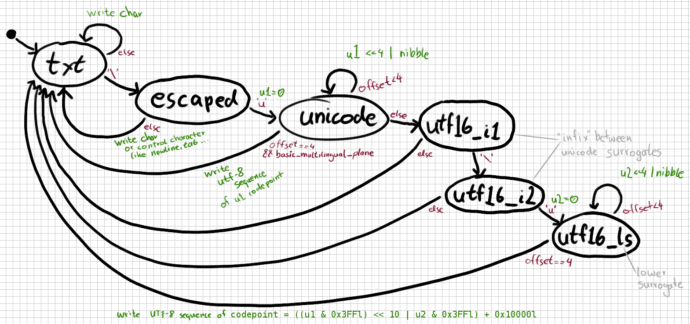

# UTF-8 JSON String Unescaper in C

I've got some issues with the
[Kubernetes filter in fluent-bit](https://github.com/fluent/fluent-bit/tree/master/plugins/filter_kubernetes).
And I believe that its `unescape_string` function is the problem.

Now I want to fix it but really don't have any experience in programming C ...

This is my first attempt to unescape a
[JSON string](http://www.ietf.org/rfc/rfc4627.txt). It may even work :-)

## State Machine

## TODO

1. Support Unicode on top of the
[Basic multilingual plane](https://en.wikipedia.org/wiki/Plane_%28Unicode%29#Basic_Multilingual_Plane)
2. Escape UTF-8 with bit shifting. Devide and modulo works but the former is easier to read and probably faster. See https://github.com/akheron/jansson/blob/master/src/utf.c
3. Replace camelCase with under_scores in variable names.
4. More code comments
5. Format the code according to how they do it at fluent-bit
